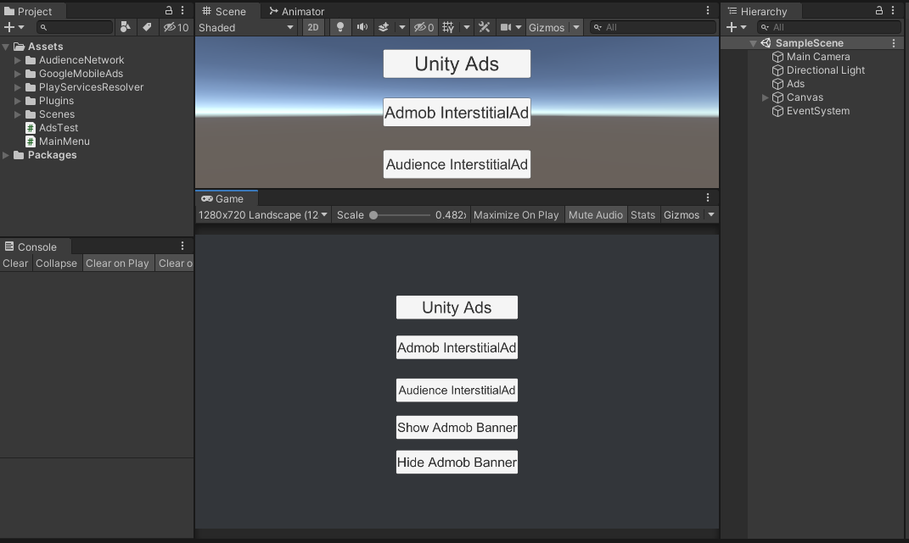
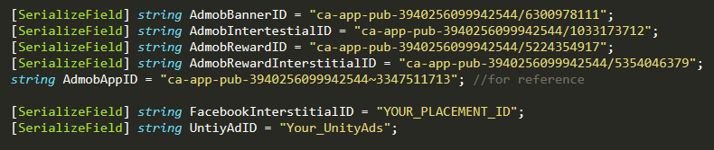

# Unity-Ads-Admob-Facebook-Audience-Network
Minimal Code for Unity Ads, Admob and Facebook Audience Network - Unity 2018, Unity 2019 and Unity 2020.

**Just Add the AdsTest.cs to First scene. You can call its functions anywhere in the project.**

**Don't forget to Add Your Ads IDs**

**Useful Links**

1. Google Mobile Ads Unity Plugin
[Google Mobile Ads Unity Plugin](https://github.com/googleads/googleads-mobile-unity/releases)
2. Facebook Audience Network Unity Plugin
[Facebook Audience Network Unity Plugin](https://developers.facebook.com/docs/audience-network/guides/adding-sdk/unity/)
3. Unity Advertisement Can be downloaded from Windows->Package Manager inside Editor. Or go to Services tab to activate Unity Ads

**Code Example**

Initialize All the required funtions in another script e.g. MainMenu.cs, and just once in the very first scene.

1. Initialize Admob SDK

`AdsTest.Instance.InitGoogleAdsSDK();`

2. Initialize Facebook Audience Network

`AdsTest.Instance.InitFacebookInterstitial();`

3. Initialize Unity Ads

`AdsTest.Instance.InitUnityAds();`

